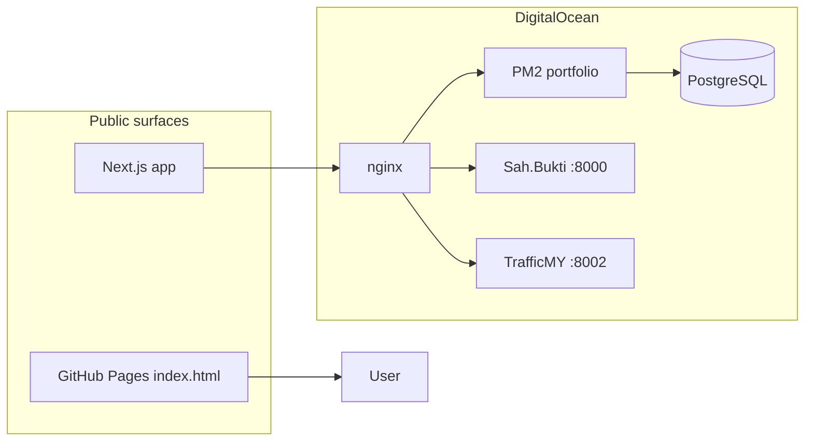

<div align="center">

# arifaqyl.me

**Portfolio + live product lane for shipped systems, not slide decks.**

[](https://arifaqyl.me)
[](https://nextjs.org)
[](https://www.typescriptlang.org)
[](LICENSE)

[Live site](https://arifaqyl.me) · [Sah.Bukti](https://arifaqyl.me/sahbukti/) · [TrafficMY](https://arifaqyl.me/traffic/) · [GitHub profile](https://github.com/arifaqyl)

</div>

---

## What this is

A dual-surface portfolio for **Arif Aqyl**:

| Surface | Role |
|---------|------|
| **Manus-style homepage** | Dark visual front door on GitHub Pages — wave canvas, expandable project cards, live app lane |
| **Next.js app** | Full-stack case-study system on the droplet — Prisma, admin, SEO routes, project depth |

The goal is simple: make the work **easy to scan, easy to trust, and easy to open**.

---

## Live products

| Product | What it does | Link |
|---------|--------------|------|
| **Sah.Bukti** | WhatsApp micro-seller ops — review-gated ledger, receipts, exports | [Open app](https://arifaqyl.me/sahbukti/) |
| **TrafficMY** | Malaysian transport disruption board — GTFS, official alerts, social ingest | [Open dashboard](https://arifaqyl.me/traffic/) |

Both run on the same DigitalOcean droplet behind nginx path routing.

---

## Featured repos in this portfolio

| Project | Type | Repo |
|---------|------|------|
| Sah.Bukti | live product | [sah-bukti](https://github.com/arifaqyl/sah-bukti) |
| TrafficMY / AduanMY | live data product | [aduanmy](https://github.com/arifaqyl/aduanmy) |
| Vlog Automation | media automation | [vlog-automation](https://github.com/arifaqyl/vlog-automation) |
| Clip Finder | highlight extraction | [clip-finder](https://github.com/arifaqyl/clip-finder) |
| Student Bot | private ops stack | private |

---

## Architecture



---

## Stack

**Visual homepage**
- HTML / CSS / vanilla JS
- Canvas2D wave background
- Expandable project index + detail viewer

**App layer**
- Next.js App Router
- TypeScript
- Prisma + PostgreSQL
- NextAuth (owner admin)
- PM2 + nginx on DigitalOcean

---

## Local development

```bash
git clone https://github.com/arifaqyl/arifaqyl.github.io.git
cd arifaqyl.github.io
npm install
cp .env.example .env
```

Set in `.env`:

```env
DATABASE_URL=
NEXTAUTH_SECRET=
NEXTAUTH_URL=http://localhost:3000
GITHUB_ID=
GITHUB_SECRET=
ADMIN_GITHUB_LOGINS=
NEXT_PUBLIC_SITE_URL=http://localhost:3000
```

Run:

```bash
npm run prisma:generate
npm run dev
```

Optional seed:

```bash
npm run seed
```

Deploy helpers:

```bash
python scripts/deploy_do.py   # sync + build + PM2 restart on droplet
```

---

## Routes

| Route | Purpose |
|-------|---------|
| `/` | Homepage with live apps + project docs |
| `/projects` | Full project index |
| `/projects/[slug]` | Case study depth |
| `/now` | Current focus |
| `/contact` | Contact form |
| `/admin` | Owner-only CMS |
| `/legacy/index.html` | Original full-screen visual homepage |

---

## Design principles

1. **Shipped proof first** — live apps get their own lane, not buried in a generic grid
2. **Read like documentation** — problem → architecture → build → result
3. **Manus energy, less bloat** — dark palette, mono labels, accent green, no heavy motion stack
4. **Repo quality matters** — README, license, security policy, and structured project data

---

## License

MIT — see [LICENSE](LICENSE).

<div align="center">
<sub>Built by <a href="https://github.com/arifaqyl">Arif Aqyl</a> · Software Engineering @ UniKL MIIT</sub>
</div>
